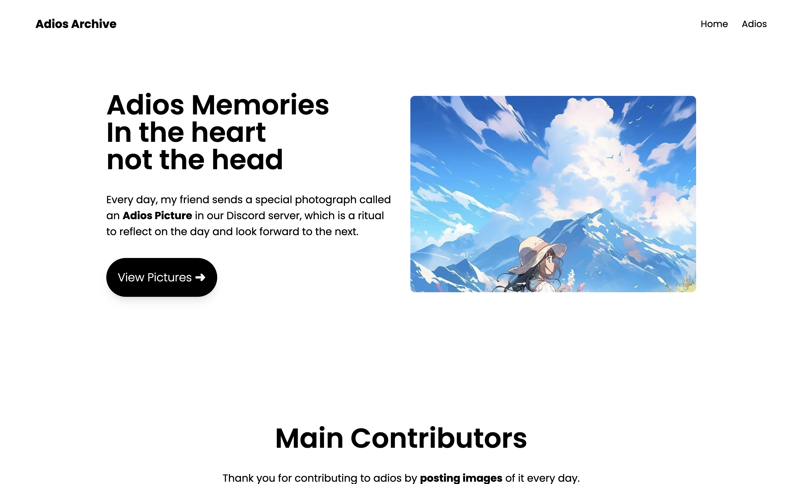

---

# Adios Archive

## Overview

Adios Archive is a website built with [Astro](https://astro.build/) that allows you to view Adios Pictures, which are pictures sent by friends in a Discord channel to reflect on their days and say goodbye to today.

## Features

- **View Adios Pictures**: Browse through a collection of pictures sent by friends in the Adios Discord room.
- **Statistics**: Retrieve and display statistics about the Adios Pictures.
- **Automated Updates**: A Discord bot listens to the Adios Discord room and automatically adds new pictures to the database.

## How It Works

1. **Discord Bot**:
   - A bot listens to the Adios Discord room.
   - When a picture is sent, the bot captures it and stores it in the database.

2. **Node Server**:
   - A simple Node.js server retrieves information such as statistics and Adios Pictures from the database.
   - The server serves this data to the Astro website.

### Usage

- Access the Astro website at `http://localhost:3000` to view Adios Pictures and statistics.

## Contributing

Contributions are welcome! Please open an issue or submit a pull request if you have any suggestions or improvements.

## License

This project is licensed under the MIT License. See the [LICENSE](LICENSE) file for details.

## Contact

- **Author**: punchanabu
- **GitHub**: [punchanabu](https://github.com/punchanabu)

---
